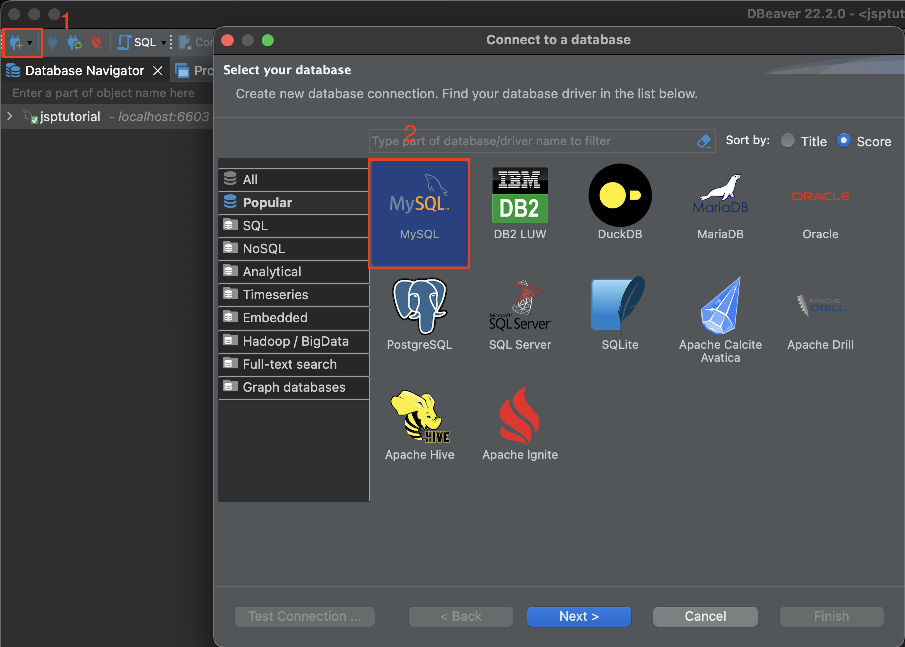

Env Set up

1. install homebrew on Mac
   `/bin/bash -c "$(curl -fsSL https://raw.githubusercontent.com/Homebrew/install/HEAD/install.sh)"`

2. install git with homebrew
   `brew install git  `

3. install docker with homebrew
   `brew install docker`

4. install Mysql GUI DBeaver
   `brew install --cask dbeaver-community`
   https://dbeaver.io/download/

   

# Usage

1. open and run docker app
2. login to your own git account and clone the git repo, `git clone https://github.com/haoli94/data_science_projects.git`
3. go to data_science_projects directory and run
   `docker build -t dsmysql:0.1 .`
4. to start sql server, `docker run --detach --name=dsmysql --publish 6603:3306 dsmysql:0.1`
5. open DBeaver, follow instructions below
   

   
6. `./backup` to backup the database 
7. `./restore` to restore the database from last backup
8.  `./reboot` to kill the database and restart to original data

possible issues:

https://ganeshchandrasekaran.com/dbeaver-public-key-retrieval-is-not-allowed-77eba055bbcd

docker run --detach --name=jspmysql --publish 6603:3306 jspmysql:0.1
